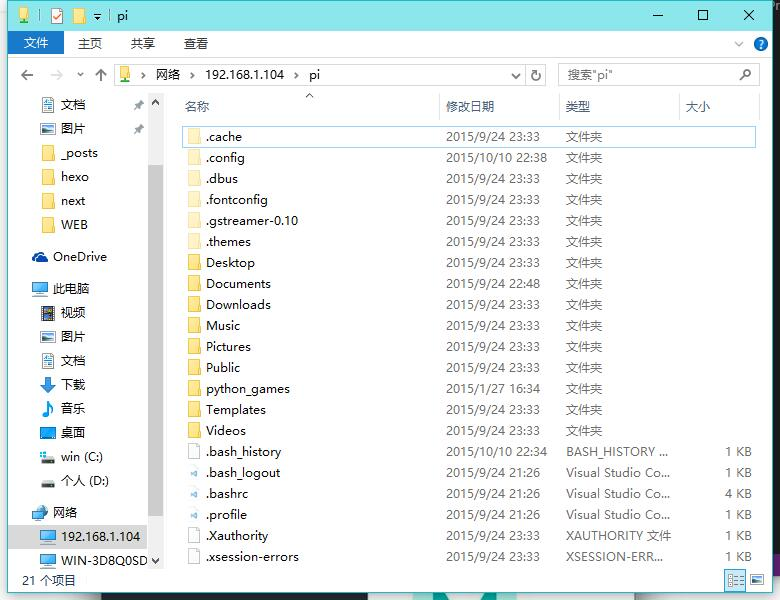

通过使用samba服务，可以自由访问修改树莓派home目录下的文件
* ## 安装 smaba:
``` bash
sudo apt-get install samba samba-common-bin
```
* ## 修改配置文件
``` bash
sudo nano /etc/samba/smb.conf
```
下面的配置是让用户可以访问自己的 home 目录
1. 开启用户认证，找到“##### Authentication #####”，添加“security = user”
2. 配置用户可以读写自己的 home 目录，在“[homes]”节中，把 “read only = yes” 改为 “read only = no”
3. 找到browseable=no改为yes 否则等会访问时此文件夹会隐藏
* ## 重启samba服务
``` bash
sudo /etc/init.d/samba restart
```
* ## 把系统默认用户pi添加到samba
``` bash
sudo smbpasswd -a pi
```
根据提示输入密码
* ## windows访问
打开文件资源管理器，输入\\192.168.1.104\pi
