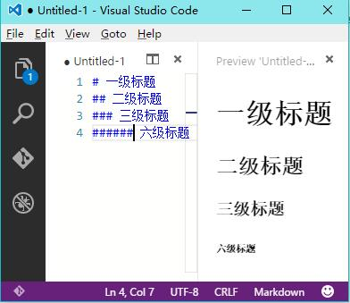
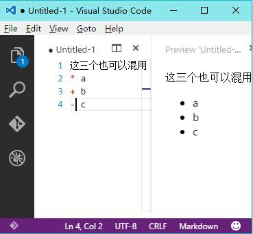
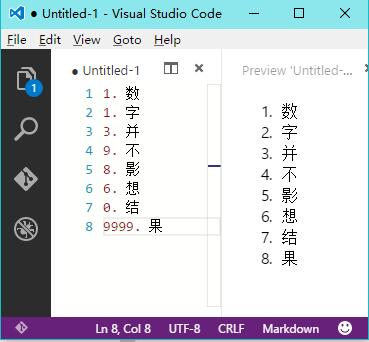
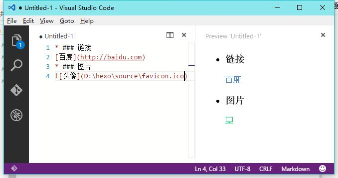
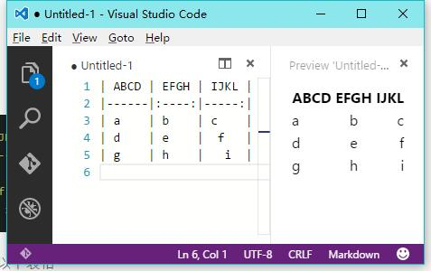

> **Markdown 是一种轻量级的「标记语言」，它的优点很多，目前也被越来越多的写作爱好者，撰稿者广泛使用。**

## Markdown的一些简要规则
### 标题
在 Markdown 中，如果一段文字被定义为标题，只要在这段文字前加 # 号即可。

```# 一级标题
## 二级标题
### 三级标题
###### 六级标题
```
在行首插入 1 到 6 个 # ，对应到标题 1 到 6 阶


* ### 列表
Markdown 支持有序列表和无序列表。
无序列表使用星号、加号或是减号作为列表标记：
```
* a
+ b
- c
```
显示的结果都是一样：



有序列表则使用数字接着一个英文句点：
```
1. a
2. b
3. c
```
但是数字的顺序却并不影响生成的有序列表结果
像：
```
1. a
1. b
1. c
```
或者：
```
3. a
8. b
4. c
```
最后生成的结果都是



所以当你需要在行首输入类似**3.14**这样的带.数字时需要在.前面加上'\'就像**3\\.14**
### 引用
如果你需要引用一小段别处的句子，那么就要用引用的格式。
在句子前面加上大于号例如：
**\> 这是引用**
显示效果：
> 这是引用

### 图片与链接
链接的格式是这样： \[链接显示的文字](链接地址)
图片的区别在于前面多了一个'!'


### 粗体和斜体
Markdown 的粗体和斜体也非常简单，用\*\*包含一段文本就是粗体的语法，用\*包含一段文本就是斜体的语法。

\*\***粗体**\*\* 

\**斜体*\*
### 表格
```
	| ABCD | EFGH | IJKL |
	|------|:----:|-----:|
	| a    | b    | c    |
	| d    | e    |  f   |
	| g    | h    |   i  |
```
上面的格式就能生成以下表格  
其中':'是标记对其方式，放后面就是右对齐两边都有就是居中了，当然放前面就是默认的格式左对齐了。  
 


不同的软件表格显示的效果也不一样
表格应该是markdown中最坑的地方了，反正markdown可以嵌去html语句，完全可以用它来画。

	
### 代码
如果你只想高亮语句中的某个函数名或关键字，可以使用 `function_name()` 实现通常编辑器根据代码片段适配合适的高亮方法，但你也可以用 \`\`\` 包裹一段代码，并指定一种语言
```java
public class Hello{
	public static void mian(String [] args){
		System.out.printls("Hello World!");
	}
}
```
> 注意\`是数字1左边那个键

### 分割线
连续三个以上`*`或`-`

line1

******

line2

### 参考文档
- [Markdown 官方教程](https://markdown.com.cn/)