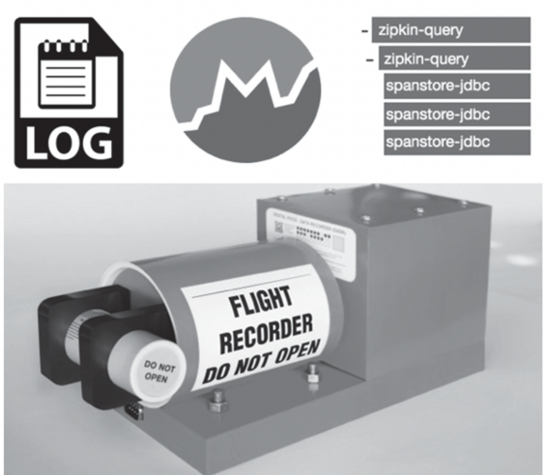

> 可观测性（ Observability ）主要是指了解程序内部运行情况的能力。我们不希望应用发布上线后，对应用的内部一无所知。对于我们来说，整个应用就是一个黑盒子。即便应用出现错误或者发生崩溃，我们也可以得到崩溃前的所有相关数据，这也是飞机黑匣子（ Flight Recorder ）设计的出发点，如 图1 所示。

目前，关于可观测性的架构设计主要涉及三个部分：日志（logging）、度量（Metrics）和追踪（Tracing）。下面就从这三个方面详细阐述可观测性架构的设计。

# 日志
要想了解系统的运行情况，最 简单的方法就是查看日志。 为此，我们创造了非常多的日志框架、工具和系统，如日志文件打印、日志文件采集工具、日志分析系统等。 但是，在 实际运维中，我们不能将所有信息事无巨细地全部记录下来，这样做反而没有意义。 我们需要为日志设置不同的级别，如 debug、error、info 等，在开发、测试、生产等不同环境下开启不同的日志级别，并保证在系统运行时能够实时调控这些日志级别。
通常，我们不用考虑日志处理的问题，毕竟日志处理技术经过长时间的发展，目前已经非常成熟，几乎所有的编程语言都有对应的日志框架。目前，云厂商基本上都会提供日志服务，对接非常简单，或者自行安装成熟的日志处理系统，如 ElasticStack 等。

# 度量
度量不仅包括 CPU 负载、内存使用量等技术指标的度量，还包括非常多的业务度量（ Business Metrics ），如每分钟的交易额、每分钟会员登录数等。对于这些业务度量参数，我们在做架构设计的时候，需要以参考指标的方式全部罗列出来，以便于观测上线后的数据，并做出相应的业务决策。
这里可能会有读者产生疑问，我们已经使用日志记录了相关的数据，数据库中也保存了最终的数据，为什么还要增加对数据的记录？为了解答这个问题，我们首先看一下如下区别。

第一，日志记录的是发生在某个时间点的事情，其中包含非常多的细节，可以说是事无巨细的。

第二，数据库记录的是当前数据的最新快照，我们通常不会关注中间的过程，如电商网站的商品价格可能经过多次调整，但数据库通常只会记录商品的最新价格。

第三，度量统计的是一个窗口期的聚合数据，可以是平均值，也可以是累计值。如果是 CPU 负载，就统计一段时间的平均值；如果是 1 分钟内交易的订单数，就需要统计累计值。还有一类比较特殊，就是那些没有时间区间的情况，如计数器等，在应用启动后的整个运行期间，它的值会不停地累加，在应用重启后它会被重新计算。
虽然日志可以计算出一些数据，如订单数、订单金额等，但这里需要考虑数据分析的成本和实时性，以更好地实现计算资源、存储节约和快速查询等。而度量统计的是窗口期的数据，所以不需要再次计算，从而节约了计算资源；同时也不需要保存窗口期中每一条具体的数据，因此可以节约存储资源；从用户角度来说，由于数据经过了窗口期的预处理，因此查询响应的速度也会更快。
总体来说，度量部分处理的是可观测性数据中的垂直场景。当我们更关注某一窗口期的聚合数据，同时关注点主要聚焦于数据的趋势和对比时，度量刚好能够满足这类需求。

典型的度量指标主要由以下 5 个部分组成：

1. 名称：因为度量指标的名称要表达其代表的意思，所以最好采用命名空间级联的方式，可以使用类似域名的“ . ”分隔，或者使用 Prometheus 中采用的“ _”分隔。
2. 时间点：采集度量的时间点，通常由度量框架自动设置。
3. 数字值：度量值只能为数字值，不能为字符串等其他值。
4. 类型：典型的类型分别为计数器、直方图、平均比率、计时器、计量表等。
5. 标签：主要包括一些元信息，如来源服务器标识、应用名称、分组信息、运行环境等。标签是为了方便后续的度量查询和再聚合处理。
当以上信息保存到 Prometheus 等度量系统后，我们可以根据上述结构进行查询。PromQL 是 Prometheus 提供的度量查询语言。

最后为大家介绍基于度量系统的一些预警规则。预警规则非常丰富，下面列举几条以方便大家参考：

1. 阈值预警：当某一度量指标的值低于或高于某一预设值时，就会触发警报。例如，CPU 的负载、业务上的度量值跌至零，这些都会触发预警。
2. 同期数据对比：在某些场景下，通过绝对值判断是不能发现系统问题的，比如，一个电商网站每天不同时段的交易额是有差别的，所以比对每周同一天同一时段的数据来判断问题会更加精确。
3. 趋势预警：主要是针对计数器类型设置的预警，如果度量数值出现激增或骤降，或者游离在正常的曲线趋势之外，就需要引起我们的注意。
回到实际的应用开发，大多数云厂商也提供了度量集成化服务，如阿里云的Prometheus 服务。在程序中，我们基本上只需要直接对接即可，诸如度量指标的采集、存储、监控、告警、图表展现等数据监控服务。

# 追踪

微服务架构后基本上是分布式的架构设计。一个简单的 HTTP 请求可能涉及 5 个以上应用，一旦出现问题，就会很难快速定位。例如，用户反馈会员登录非常慢，基本要花费 5 秒以上的时间，这种情况该如何定位问题所在？定位问题涉及登录的 Web应用、账号验证服务、会员信息服务、登录的安全监控系统，还涉及 Redis、数据库等。如果没有一个高效的追踪系统，排查定位问题的复杂度可想而知。
首先，让我们看一下追踪系统的基本元素。

## traceId
traceId 用来标识一个追踪链，如一个 64 位或 128 位长度的字符串。不同追踪链的 traceId 不同。但在某一个追踪链中，traceId 始终保持不变。traceId 通常在请求的入口处生成。如对于 HTTP 请求，traceId 基本上在网关层生成，也可以延后到具体的 Web 应用中生成。在产品环境中，并不是所有的请求都要启动追踪。我们只会采样部分请求，如只会追踪 2% 的请求，这样做主要是考虑到追踪对整个系统会造成额外的开销。当然，在测试环境中，为便于排查问题，建议所有请求都开启追踪。

## spanId
spanId 用于在一个追踪链中记录一个跨时间段的操作。例如，我们访问数据库或者进行 RPC 调用的过程，就对应于一个 spanId。在一个区间（span）中，ID 的作用是便于识别。ID 通常是一个 64 位的 long 型数值，名称的作用是便于用户了解是什么操作，起始时间和结束时间的作用是便于了解操作时长。另外，区间还可以包含其他元信息。总的来说，一个追踪链是由多个区间组成的。区间提供具体的操作信息。区间的生成会涉及应用中的代码，我们称之为区间的埋点。

## parentId
在追踪链中，我们可能需要对一些区间进行分组，如将某一应用内部的多个区间归在一起，这样就可以了解该应用在整个调用链中消耗的时间。其解决方案是为区间添加parentId，将不同类别的区间归在一起。通常，我们在进入一个应用时会进行 parentId 的设置。例如，进入会员登录应用时会设置一个 parentId，在进入账号验证服务时会设置一个 parentId ，这样我们就能根据不同的应用对区间进行归类。在同一个应用内部，我们还可以基于应用的 parentId 设置子 parentId。如果想要归类数据库相关的操作，则将操作全部列在数据库的 parentId 下。
追踪链可以将整个请求在不同应用和系统中的操作信息串联起来。我们只要输入traceId ，就可以在追踪系统中了解整个调用链的详细信息。那么，在不同的应用和系统中，路径和区间信息又是如何采集的呢？Zipkin 是一款知名的路径跟踪产品，其中 Brave SDK 可以实现路径和区间信息的采集。Brave SDK 负责创建路径和区间，同时将这些信息异步上报给 Zipkin，完成追踪链的数据采集工作。由于路径和区间信息的采集是通过远程调用实现的，因此这个采集过程一定要是异步实现的，只有这样，才能确保不会影响到正常的业务操作。最典型的采集方法就是对接 gRPC、Kafka 和 RSocket 等异步协议或系统，以确保数据的采集全部是异步的。